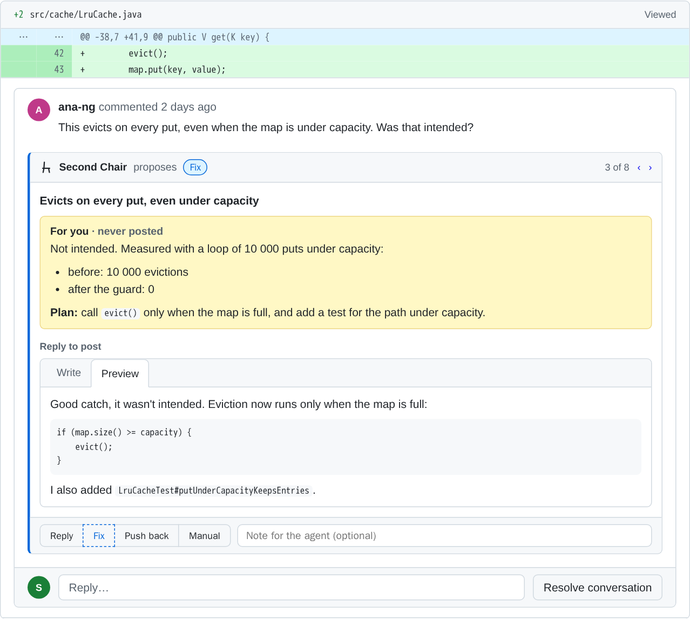
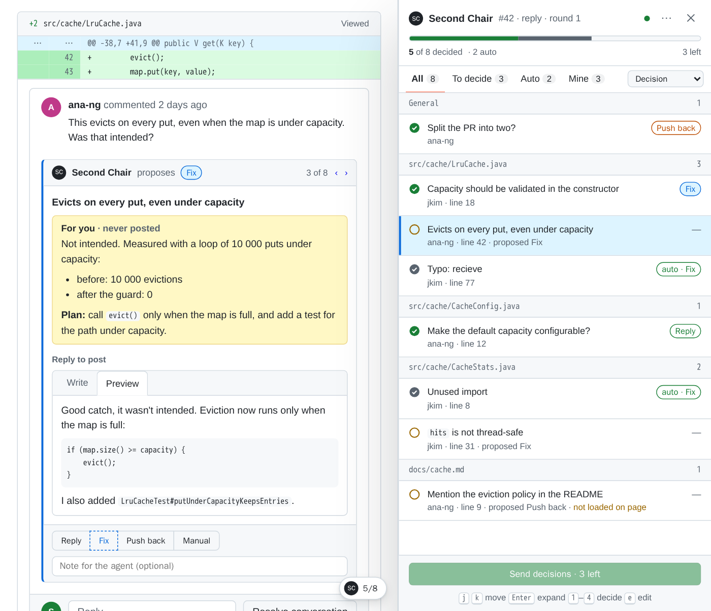
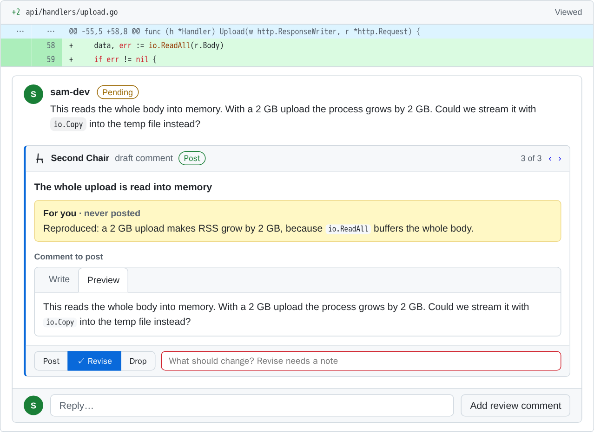
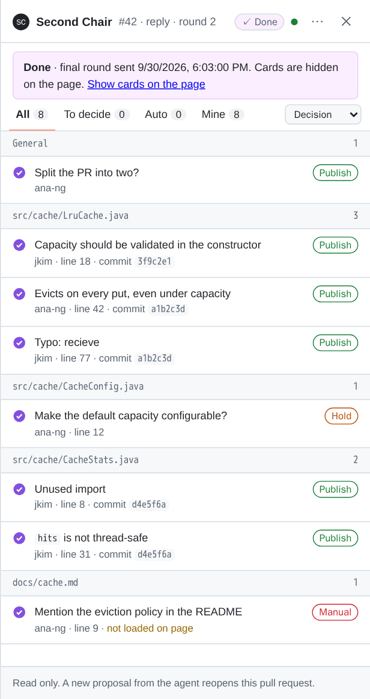

# Second Chair

**AI prepares. You decide.**

Work through GitHub code reviews with your coding agent. Nothing gets posted without your approval.

<picture>
  <source media="(prefers-color-scheme: dark)" srcset="docs/images/card-dark.png">
  
</picture>

## What it does

- Your coding agent proposes a reply for every review thread on your pull request, or a comment for every finding on someone else's.
- Second Chair shows each proposal as a card under its thread on github.com.
- You decide every card: keep it, edit the text, or tell the agent what to change.
- The agent posts exactly the text you approved, through `second-chair publish`.

## Install

You need:

- Claude Code with plugin support.
- Node 22 or newer.
- The GitHub CLI `gh`, version 2.48.0 or newer, logged in (`gh auth status`). Second Chair makes every GitHub call through it.
- A user script manager: Tampermonkey or Violentmonkey in Chrome, Edge or Firefox, or Tampermonkey in Safari. See [Browser setup](#browser-setup).

Windows works with Node 22 or newer and Git for Windows. Claude Code's Bash tool runs in Git Bash there. `npm install -g` creates a `second-chair` command on Windows too.

Then:

1. Install the plugin in Claude Code:

   ```
   /plugin marketplace add Patras3/second-chair
   /plugin install second-chair@second-chair
   ```

2. Start a new Claude Code session. Its start hook runs the local server. Run `/second-chair:setup` in that session. It checks Node, `gh` and the server, and walks you through the browser steps.
3. Open <http://127.0.0.1:7788/second-chair.user.js> in your browser. The script manager offers to install the script. Updates come from the same address.

Open any pull request on github.com. A small **SC** pill at the bottom right means it works.

### Where the command runs

The plugin puts `second-chair` on the `PATH` of Claude Code's Bash tool only. Your own terminal does not have it. With the plugin alone, run the commands inside Claude Code: type `!` and the command, for example `! second-chair doctor`, or ask the agent to run it. `npm install -g github:Patras3/second-chair` puts the command in your own shell too.

### Without Claude Code

```
npm install -g github:Patras3/second-chair
second-chair start
```

This gives you the same `second-chair` command. Any agent that can run shell commands can drive it. [docs/PROTOCOL.md](docs/PROTOCOL.md) describes the formats and the order of calls.

## Browser setup

Second Chair runs on github.com as a user script. A script manager extension loads it.

| Browser | Script manager | Extra step |
|:--|:--|:--|
| Chrome | Tampermonkey or Violentmonkey | Allow user scripts (below) |
| Edge | Tampermonkey or Violentmonkey | Allow user scripts (below) |
| Firefox | Tampermonkey or Violentmonkey | None |
| Safari | Tampermonkey | None |

In Chrome and Edge, an extension may run user scripts only after you allow it:

1. Install the script manager from the Chrome Web Store or from Edge Add-ons.
2. Open `chrome://extensions` (in Edge: `edge://extensions`).
3. Click **Details** on the script manager.
4. Turn on **Allow user scripts**.
5. Older versions have no such switch on the details page. Turn on **Developer mode** at the top right of the extensions page instead.
6. Open <http://127.0.0.1:7788/second-chair.user.js> and click **Install**.

In Firefox and Safari, install the script manager and open the same address. In Safari, also turn on the extension in Safari's settings and allow it on github.com.

## Answer a review on your pull request

In Claude Code, on your pull request's branch:

```
/second-chair:respond 42
```

The agent reads every unresolved thread and writes a proposal for each one. Open the pull request on GitHub. The cards are under the threads.

**Round 1: decide.** Each card shows:

- **For you · never posted**: what the agent checked, and its plan for a fix.
- **Reply to post**: the draft reply. **Preview** shows it as GitHub will. **Write** lets you edit it, and your text wins.
- The buttons **Reply**, **Fix**, **Push back** and **Manual**. The agent's proposal has a dashed outline. **Manual** means you handle the thread yourself.
- **Note for the agent**: an instruction, for example "fix it, but keep the old method".

The agent marks an item **auto** when it has no doubt, such as a typo. An auto item counts as decided with the agent's proposal and shows as one line. Pick another button to override it.

**Send decisions** at the bottom of the side panel unlocks when every thread has a decision. The agent then makes the fixes you approved and commits them. It does not push yet.

**Round 2: publish.** The cards come back with the final replies and the commits. The buttons are **Publish**, **Hold** and **Manual**. After you send, the agent pushes the commits and runs `second-chair publish`. It posts the replies you marked **Publish**, with the text as you left it. **Hold** and **Manual** post nothing.

Respond mode posts nothing on GitHub until you send round 2.



The pill at the bottom right opens the side panel. The panel lists every thread, grouped by file. Selecting a row scrolls the page to its thread. A general item for the whole pull request has no thread, so its card opens in the panel.

## Review someone else's pull request

```
/second-chair:review 42
```

The findings come from the agent's own review, from another skill such as `/code-review`, or from your notes. The agent adds them as comments to a pending (draft) review on GitHub. GitHub allows one pending review per person and pull request. If you already started one on this pull request, the agent adds to it. Your own comments and your review body get cards too, marked **Your draft comment**.

**Round 1.** Each comment has **Post**, **Revise** and **Drop**. **Revise** needs a note that says what to change. The note field stays red until you write one.

**Round 2.** The agent rewrites the revised comments. The cards show the final texts with **Post** and **Drop**. After you send, `second-chair publish` edits and deletes the pending comments to match your decisions.

The pending review on GitHub now holds exactly what you chose. **Submitting it is your move**, on GitHub. Review mode never submits the review unless you ask the agent to. Then the agent submits it with the event you named: comment, approve or request changes.



## When it is done

A pull request's work in Second Chair is done when one of these happens:

- You send the final round (round 2). This counts even when the server was down and the decisions went to the clipboard.
- The agent runs `second-chair close`.
- You pick **Mark as done** in the panel's **⋯** menu.

The cards then leave the page, and the pill reads **SC ✓ done**. The panel shows a purple **Done** banner and a read-only list of every decision and commit. **Show cards on the page** brings the cards back, read only, until the next reload. A new proposal from the agent starts over.



## Keyboard

The keys work when the panel is open and the focus is not in a text field.

| Key | Action |
|:--|:--|
| `j` / `k` | Next / previous thread. The arrow keys do the same once a row is selected. |
| `Enter` | Open or fold the selected card. |
| `1` to `4` | Pick the first to fourth button of the selected thread. Round 2 and review mode have fewer buttons. The same key again clears the choice. |
| `e` | Edit the reply of the selected thread. |
| `Esc` | Leave a text field. |

## How it stays safe

- The server listens on `127.0.0.1` only. Other machines cannot reach it.
- Every `/api` request must carry the header `X-Second-Chair: 1`. A web page cannot add a custom header to a request to another site without a CORS preflight, and the server does not allow one. Other sites therefore cannot read or write your proposals and decisions.
- The server checks the `Host` header. It must be `127.0.0.1` or `localhost` with the server's port. This stops DNS rebinding, where a hostile page reaches a local server under its own domain name.
- The browser never sees a GitHub token. The userscript talks only to the local server, never to the GitHub API. Every GitHub call goes through `gh` on your machine.
- Nothing is posted where others can see it, except through `second-chair publish`. It posts the text from your final-round decisions, and records each action. A second run skips what is already done.
- In review mode, `second-chair draft` writes the agent's findings to your pending review. A pending review stays visible only to you until you submit it.
- The skills tell the agent never to post, edit or resolve anything by hand, and never to touch comments by other people.
- The cards render markdown with `marked` and clean it with `DOMPurify`. Both load from jsDelivr at fixed versions. The cleanup also removes styles, classes, forms and form controls, so a payload cannot put working buttons on the page.

## Commands

With the plugin alone, these commands run inside Claude Code. See [Where the command runs](#where-the-command-runs).

| Command | What it does |
|:--|:--|
| `second-chair start [--quiet]` | Starts the server in the background, unless one of the same or a newer version already answers on the port. Restarts an older server that `start` launched. The server writes a pid file and a log to the data directory. |
| `second-chair stop` | Stops the server that `start` started. It signals nothing when the server on the port has another process id. |
| `second-chair doctor` | Checks Node, `gh`, the server, its version and the port. Prints the userscript address and what to fix. |
| `second-chair serve [--port N]` | Runs the server in the foreground. |
| `second-chair threads [PR]` | Prints the unresolved review threads as JSON. Your own pending comments are left out. |
| `second-chair pending [PR]` | Prints your pending review and its comments as JSON, or `null`. |
| `second-chair draft [PR] <comments.json> [--body-file F]` | Adds comments to your pending review. Creates the review when you have none. With only `--body-file F`, it starts a review that has just a body. |
| `second-chair build --repo O/N --pr N --round R --head SHA [--mode review] <items.json>...` | Wraps items into a payload, checks it and prints it. |
| `second-chair push <payload.json>` | Hands the proposals to the server, so the page shows them. |
| `second-chair wait --repo O/N --pr N --round R [--timeout S]` | Waits until you send the decisions, then prints them. |
| `second-chair get --repo O/N --pr N --round R` | Prints the decisions now, or exits with code 3. |
| `second-chair put-decisions <decisions.json>` | Hands the decisions from the clipboard to the server. The page puts them there when the server is down. Prints the server's reason when it refuses them. |
| `second-chair publish --repo O/N --pr N [--submit EVENT]` | Carries out the final round's decisions on GitHub, once. Only review mode takes `--submit`, with `COMMENT`, `APPROVE` or `REQUEST_CHANGES`. |
| `second-chair close --repo O/N --pr N` | Marks the work on the pull request done. The page hides its cards. |
| `second-chair status` | Lists the pull requests and rounds on the server. |

`PR` is a pull request number or URL. Without it, the commands use the pull request of the current branch. `--repo O/N --pr N` works too.

Exit codes: `0` ok, `1` error, `2` `wait` timed out, `3` `get` found no decisions yet.

Settings:

- `SECOND_CHAIR_PORT`: the server port. The default is `7788`.
- `SECOND_CHAIR_HOME`: the data directory. The default is `${XDG_DATA_HOME:-~/.local/share}/second-chair`.

## Run it as a service

The plugin's hook starts the server only when a Claude Code session starts. If you open GitHub before any session, the panel shows the server as off. A service keeps the server running all the time.

The service needs the command outside Claude Code, so install it with npm first:

```
npm install -g github:Patras3/second-chair
```

**Linux**, as a systemd user unit:

```bash
mkdir -p ~/.config/systemd/user
cat > ~/.config/systemd/user/second-chair.service <<EOF
[Unit]
Description=Second Chair server

[Service]
ExecStart=$(command -v node) $(command -v second-chair) serve
Restart=on-failure

[Install]
WantedBy=default.target
EOF
systemctl --user daemon-reload
systemctl --user enable --now second-chair
```

**macOS**, as a launchd agent:

```bash
mkdir -p ~/Library/LaunchAgents
cat > ~/Library/LaunchAgents/io.github.patras3.second-chair.plist <<EOF
<?xml version="1.0" encoding="UTF-8"?>
<!DOCTYPE plist PUBLIC "-//Apple//DTD PLIST 1.0//EN" "http://www.apple.com/DTDs/PropertyList-1.0.dtd">
<plist version="1.0">
<dict>
  <key>Label</key><string>io.github.patras3.second-chair</string>
  <key>ProgramArguments</key>
  <array>
    <string>$(command -v node)</string>
    <string>$(command -v second-chair)</string>
    <string>serve</string>
  </array>
  <key>RunAtLoad</key><true/>
  <key>KeepAlive</key><true/>
  <key>StandardOutPath</key><string>$HOME/Library/Logs/second-chair.log</string>
  <key>StandardErrorPath</key><string>$HOME/Library/Logs/second-chair.log</string>
</dict>
</plist>
EOF
launchctl bootstrap gui/$(id -u) ~/Library/LaunchAgents/io.github.patras3.second-chair.plist
```

Both blocks write the full paths of `node` and `second-chair` into the service file, because a service does not read your shell's `PATH`. For another port, add `Environment=SECOND_CHAIR_PORT=7790` under `[Service]`, or an `EnvironmentVariables` entry to the plist.

With the service running, the hook finds the server and starts nothing. `second-chair stop` does not stop a service. Use `systemctl --user stop second-chair` on Linux, or `launchctl bootout gui/$(id -u)/io.github.patras3.second-chair` on macOS.

The server is reachable only from the machine it runs on. A server started inside a container is reachable from the host's browser only when the container shares the host network (for example `docker run --network host`).

## Several sessions and repositories

One Second Chair server runs per machine. Every Claude Code session shares it, in every repository. The first session starts it, and later sessions find it running.

The server keeps its data per repository and pull request. Sessions that work on different pull requests do not get in each other's way.

When several sessions start at the same moment, each one tries to start a server. One server gets the port, and every session uses it.

After a plugin update, the next session restarts the server, so the new version runs. Only an older server is restarted. A newer one keeps running, and `second-chair doctor` says that your copy needs an update. A server that `second-chair start` did not launch, such as a service, is left alone. The session then prints a line that asks you to stop that server by hand.

The session start hook may take up to 30 seconds. A restart needs that time on a slow machine: the old server stops first, and the new one must start and answer.

A wait for your decisions survives a restart. `second-chair wait` and `get` keep trying for 15 seconds when the server does not answer.

A container that shares the host network (for example `docker run --network host`) shares the server too.

## Troubleshooting

**No SC pill on GitHub.**

- The pill shows only on pull request pages, such as `github.com/octo-org/example/pull/42`.
- Check that the script manager is on, and that Second Chair is enabled in its dashboard.
- In Chrome and Edge, turn on **Allow user scripts** or developer mode. See [Browser setup](#browser-setup).
- Reload the page after you install the script.

**The panel shows a red dot ("server off").** The page cannot reach the server. Start a Claude Code session, or run `! second-chair start` in one. `! second-chair doctor` shows why the server is down. In your own terminal, the commands work after `npm install -g` (see [Where the command runs](#where-the-command-runs)). Without a server, **Load from clipboard** in the **⋯** menu reads a payload from the clipboard. **Send decisions** then copies the decisions to the clipboard, and you paste them to the agent.

**Port 7788 is in use.** `second-chair doctor` says when another program holds the port. Set a free port in your shell profile, for example `export SECOND_CHAIR_PORT=7790`. Claude Code and its hook use it too, but only when Claude Code starts from that shell. Start the server again, then install the userscript again from `http://127.0.0.1:7790/second-chair.user.js`. The server writes its port into the script it serves, so the old script still calls port 7788.

**`gh` is not logged in.** Run `gh auth login` in a terminal, then check with `gh auth status`. `second-chair doctor` also reports a `gh` that is older than 2.48.0.

**A thread shows "not loaded on page".** GitHub loads long conversations in parts and folds resolved threads. Select the row in the panel. Second Chair unfolds folded threads, asks GitHub for the thread by its link, and clicks **Load more** until the thread appears. If GitHub still does not show it, the card opens in the panel, and you decide it there. The comments of a pending review show only in the **Files changed** tab.

**`publish` refuses because you have a pending review.** GitHub posts no reply when you have a pending review on the same pull request. Submit or delete that review on GitHub, then ask the agent to run `publish` again. Nothing was posted.

**`publish` refuses to add a review body.** GitHub cannot add a body to a pending review that started without one, except together with the submit. The agent asks you whether to submit now, and with which event, or to drop the body.

[docs/PROTOCOL.md](docs/PROTOCOL.md#github-limits) lists the GitHub limits behind these messages.

## Uninstall

1. Stop the server. In Claude Code, run `! second-chair stop`. If you installed the command with npm, `second-chair stop` in a terminal works too.
2. In Claude Code, remove the plugin: `/plugin uninstall second-chair@second-chair`. Remove the marketplace too, if you like: `/plugin marketplace remove second-chair`.
3. Remove Second Chair from the script manager's dashboard.
4. Delete the data directory. If you set `SECOND_CHAIR_HOME`, delete that directory instead.
   - Linux and macOS: `rm -rf "${XDG_DATA_HOME:-$HOME/.local/share}/second-chair"`
   - Windows, in PowerShell: `Remove-Item -Recurse -Force "$HOME\.local\share\second-chair"`
5. If you installed the command with npm, run `npm uninstall -g second-chair`. If you set up a service, disable it and delete its file.

## Development

- `npm test` runs the unit tests. They need Node 22 and nothing else.
- `npm run smoke` drives the userscript in Chromium against a real server. It needs Playwright: `PLAYWRIGHT=<path>/node_modules/playwright npm run smoke`.
- `npm run screenshots` renders the images in `docs/images` the same way.
- [docs/TESTING.md](docs/TESTING.md) has the live checks against GitHub and the release checklist.

## License

MIT. See [LICENSE](LICENSE).
